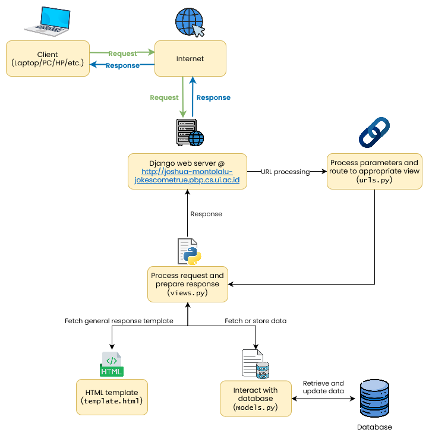

# Jokes Come True
**Nama:**   Joshua Montolalu<br>
**NPM:**    2306275746<br>
**Kelas:**  PBP F<br>

Hasil proyek dapat dilihat pada **[link berikut](https://www.google.com)**.

## Tugas 2
### 1. Jelaskan bagaimana cara kamu mengimplementasikan checklist di atas secara step-by-step (bukan hanya sekadar mengikuti tutorial).
1. Pertama, saya menginisiasi repositori lokal baru, kemudian saya membuat repositori di GitHub. Lalu, kedua repositori tersebut saya hubungkan lewat `git remote add origin https://github.com/HamletJr/jokes-come-true.git`.
2. Setelah itu, saya menambahkan file `.gitignore` dan `README.md`.
3. Saya membuat proyek Django baru dengan perintah `django-admin startproject jokes-come-true .` dan menambahkan file `requirements.txt`.
4. Untuk membuat aplikasi bernama `main`, saya menjalankan perintah `python manage.py startapp main`.
5. Untuk membuat model baru, saya memodifikasi file `models.py` dalam aplikasi `main` sebagai berikut:
```Python
class Product(models.Model):
    name = models.CharField(max_length=255)
    price = models.IntegerField()
    description = models.TextField()
    quantity = models.IntegerField()

    @property
    def is_product_available(self):
        return self.quantity > 0
```

6. Saya menyimpan model tersebut dan menjalankan perintah `python manage.py makemigrations` dan `python manage.py migrate` untuk mengaplikasikan model baru saya.
7. Saya membuat file `main.html` baru dalam direktori `main/templates`, kemudian saya modifikasi file `views.py` untuk menampilkan template tersebut dengan *context* nama dan kelas saya.
8. Kemudian, saya melakukan *routing* dengan membuat file `urls.py` dalam folder `main` dan mendefinisikan pola URL baru yang akan memanggil fungsi yang sudah didefinisikan dalam `views.py` pada langkah sebelumnya.
9. Untuk menghubungkan aplikasi `main` ini ke proyek utama, saya konfigurasi file `urls.py` dalam folder proyek utama dan menambahkan pola URL baru yang mengarah ke pola URL yang sudah didefinisikan pada langkah sebelumnya.
10. Deployment to PWS **TBA**

### 2. Buatlah bagan yang berisi request client ke web aplikasi berbasis Django beserta responnya dan jelaskan pada bagan tersebut kaitan antara urls.py, views.py, models.py, dan berkas html.


### 3. Jelaskan fungsi git dalam pengembangan perangkat lunak!
Git dalam pengembangan perangkat lunak berfungsi sebagai software *version control*, yaitu sebagai alat yang memantau versi-versi file pada suatu repositori. Git memudahkan proses pengembangan kode secara kolaboratif dengan melacak perubahan yang terjadi pada kode. Git menyediakan berbagai fitur seperti *branching* dan *merging* untuk menyelesaikan konflik antar perubahan, dan memungkinkan kita untuk kembali ke versi kode yang lebih awal jika kita membutuhkannya.

### 4. Menurut Anda, dari semua framework yang ada, mengapa framework Django dijadikan permulaan pembelajaran pengembangan perangkat lunak?
Menurut saya, framework Django dijadikan sebagai permulaan pembelajaran pengembangan perangkat lunak karena Django sudah memiliki banyak fitur yang memudahkan kita, terutama pemula, dalam proses pengembangan aplikasi web. Selain itu, perlu diingat bahwa Django merupakan framework Python, yang merupakan salah satu bahasa pemrograman yang cukup mudah untuk digunakan dan memiliki banyak fungsi *built-in* lainnya yang dapat membantu proses pengembangan *front-end* dan *back-end*.

### 5. Mengapa model pada Django disebut sebagai ORM?
Model pada Django disebut sebagai ORM karena model Django menerapkan teknik ORM atau Object-Relational Mapping, yaitu teknik pemrograman yang memungkinkan kita untuk berinteraksi dengan database kita bukan lewat query SQL, tetapi lewat objek-objek Python.