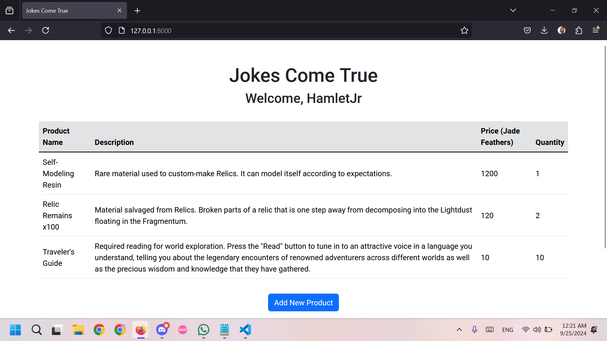
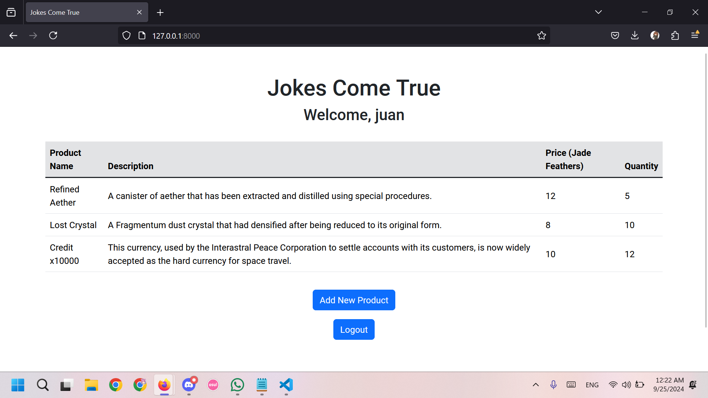
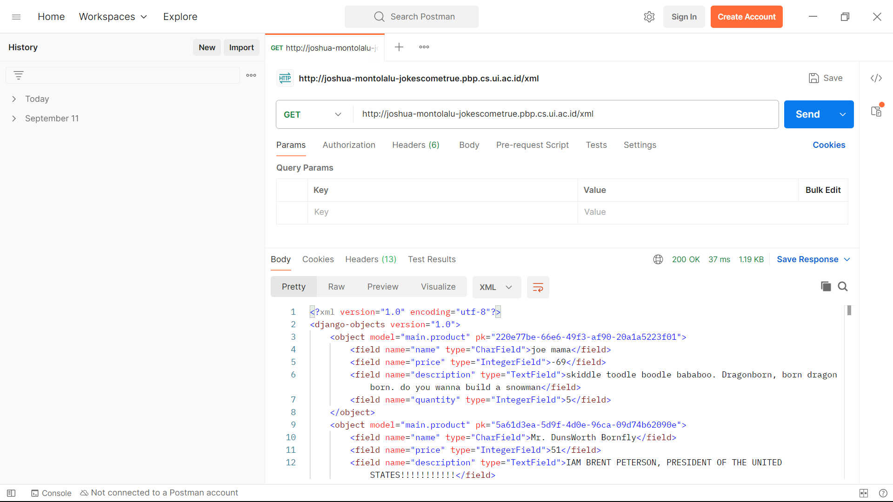
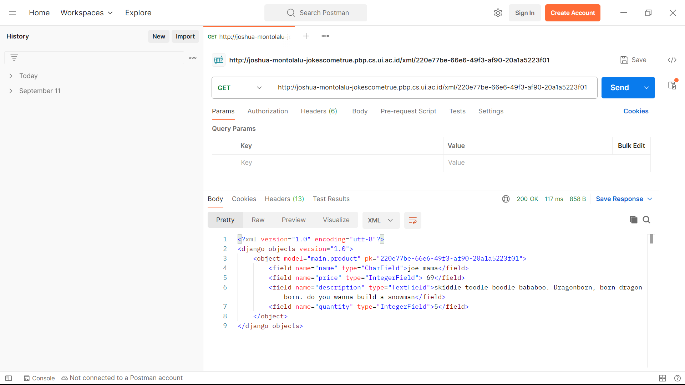
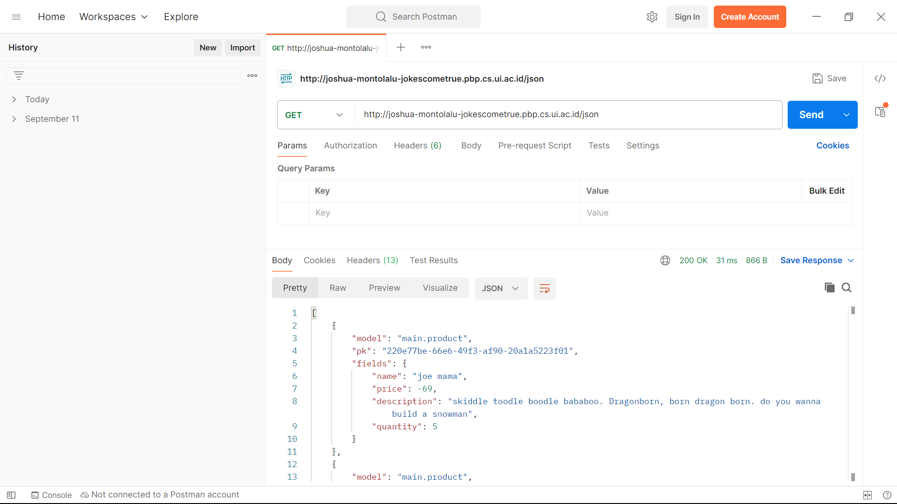
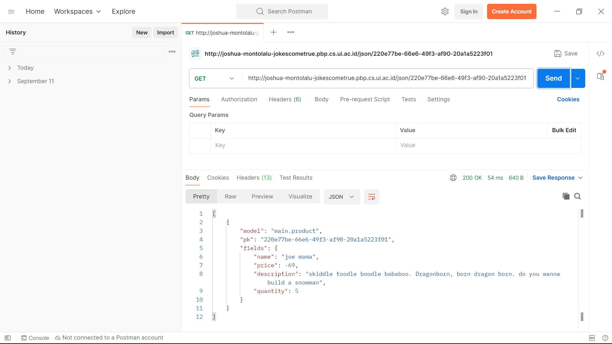
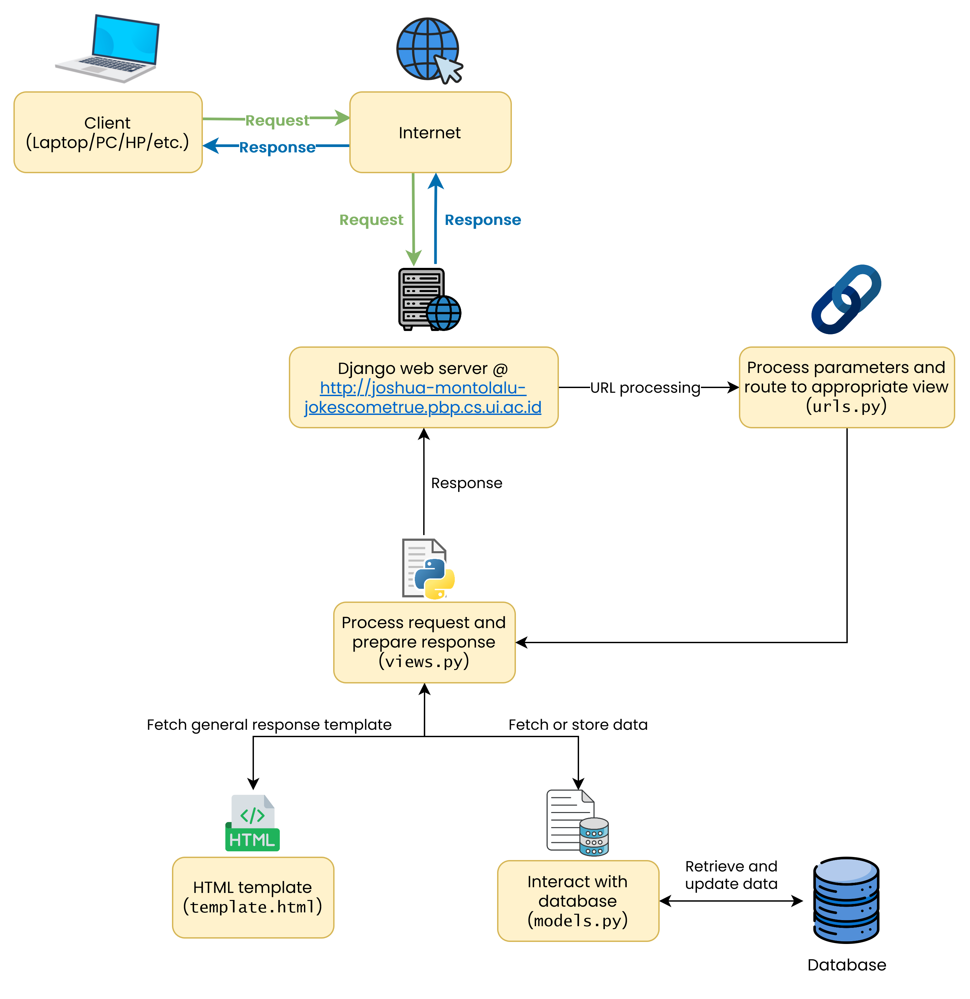

# 🪶 Jokes Come True
**Nama:**   Joshua Montolalu<br>
**NPM:**    2306275746<br>
**Kelas:**  PBP F<br>

### 🔗 Hasil proyek dapat dilihat pada [link berikut](http://joshua-montolalu-jokescometrue.pbp.cs.ui.ac.id/).

### Quick Jump!
| [Tugas 2](#tugas-2) | [Tugas 3](#tugas-3) | [Tugas 4](#tugas-4)
| - | - | - |

## 4️⃣ Tugas 4
### 1. Apa perbedaan antara `HttpResponseRedirect()` dan `redirect()`
Perbedaan antara `HttpResponseRedirect()` dan `redirect()` adalah `HttpResponseRedirect()` hanya menerima argumen URL yang akan langsung dikembalikan sebagai response *redirect* HTTP ke *client*, sedangkan `redirect()` lebih fleksibel dan dapat menerima argumen seperti `model`, `view`, atau URL biasa. Ini kemudian akan diproses oleh Django dan akan mengembalikan `HttpResponseRedirect()` dengan tujuan *redirect* yang sesuai. Karena ini, jika kita ingin mengembalikan URL ke `views` kita menggunakan `HttpResponseRedirect()`, kita perlu menggunakan metode `reverse()` dulu untuk mendapatkan URL mentahnya.

### 2. Jelaskan cara kerja penghubungan model `Product` dengan `User`!
Penghubungan model Product dengan model User sebagai 2 model (*entity*) yang berbeda dapat dilakukan dengan menggunakan konsep *foreign key* dalam *database*. Berikut adalah modifikasi model yang saya lakukan untuk tugas ini.

```Python
from django.contrib.auth.models import User

class Product(models.Model): 
    user = models.ForeignKey(User, on_delete=models.CASCADE)
```

Pada model `Product`, ditambah satu field baru yang bertipe `ForeignKey` dari model `User`. Ini berarti *primary key* dari model `User` akan dimasukkan ke dalam `Product`, sehingga setiap *record* product akan terhubung dengan tepat satu `User` berdasarkan UUID yang unik.

### 3. Apa perbedaan antara authentication dan authorization, apakah yang dilakukan saat pengguna login? Jelaskan bagaimana Django mengimplementasikan kedua konsep tersebut.
- **Authentication**<br>
Authentication adalah bentuk verifikasi terhadap pengguna yang ingin menggunakan aplikasi kita. Misal untuk kasus ini, *login* adalah salah satu contoh dari *authentication* untuk memastikan bahwa orang yang ingin mengakses atau melakukan *request* kepada aplikasi kita benar-benar orang yang sesuai, bukan orang lain. Cara Django mengimplementasi konsep ini adalah dengan `AuthenticationForm`. Dalam kasus ini, `AuthenticationForm` berisi sebuah form yang akan memverifikasi bahwa orang yang ingin mengakses aplikasi kita sebagai *user* tertentu perlu memberikan *password* yang sesuai untuk membuktikan bahwa mereka benar adalah pengguna itu. Jika otentikasi ini berhasil, baru pengguna dapat login ke akun mereka.

- **Authorization**<br>
Authorization adalah bentuk *access control* untuk menentukan siapa saja yang dapat melakukan hal-hal tertentu. Dalam Django, salah satu implementasi *authorization* adalah *views* `show_main()`. Terdapat *decorator* `@login_required()` yang memberi syarat bahwa hanya pengguna yang terdaftar di aplikasi boleh mengakses *view* `show_main()`. 

### 4. Bagaimana Django mengingat pengguna yang telah login? Jelaskan kegunaan lain dari cookies dan apakah semua cookies aman digunakan?
Django dapat mengingat pengguna yang telah login melalui konsep *session* dan *cookies*. Karena HTTP bersifat *stateless*, maka konsep *session* perlu diimplementasi dari sisi aplikasi untuk membantu kita mempertahankan status dan data dari user. Ini dilakukan dengan mengirim data berukuran kecil yaitu *cookie* ke *client*. Setiap kali *client* melakukan request, *cookie* ini akan disisipkan ke *header* request sehingga aplikasi kita dapat mengenali *client* tanpa otentikasi (login) lagi.

Kegunaan *cookie* tidak hanya dibatasi untuk otentikasi, tetapi *cookie* juga dapat digunakan untuk menyimpan preferensi pengguna, misalnya penampilan atau pengaturan tertentu. *Cookie* juga dapat digunakan untuk menyimpan *state*, misalnya isi keranjang untuk aplikasi *online shopping*.

Akan tetapi, *cookie* tidak selalu aman untuk digunakan. Salah satu contoh adalah *tracking cookie*, yaitu *cookie* yang dapat digunakan untuk melacak penggunaan web kita. Misal kita mengakses sebuah aplikasi A yang perlu memuat konten dari website B. Website B dapat menyimpan *tracking cookie* ke perangkat *client* yang mencatat nama aplikasi A. Kemudian, jika pengguna mengakses aplikasi C yang juga memerlukan konten dari website B, maka ketika kita melakukan request, *tracking cookie* yang tersimpan di perangkat akan otomatis dikirim ke website B sehingga website B akan tahu bahwa kita mengunjungi aplikasi A sebelumnya. 

Selain itu, *cookie* juga dapat disalahgunakan oleh *attacker* dengan berbagai cara seperti *cookie theft* (pengiriman data *cookie* ke *attacker* yang dapat berisi data sensitif) dan CSRF (*attacker* membuat pengguna melakukan *request* dengan *cookies* pengguna tanpa sepengetahuannya). Oleh karena itu, baik sisi *server* maupun sisi *client* perlu mengantisipasi hal ini dengan menerapkan langkah-langkah pencegahan untuk mengamankan *cookies* yang digunakan.

### 5. Jelaskan bagaimana cara kamu mengimplementasikan checklist di atas secara step-by-step (bukan hanya sekadar mengikuti tutorial).
1. Pertama, saya memodifikasi file `views.py` untuk membuat views baru untuk register, login, dan logout, yaitu `register()`, `login_user()`, dan `logout_user()`.
2. Untuk `register()`, saya menggunakan form registrasi bawaan Django yaitu `UserCreationForm`. Form ini kemudian akan divalidasi terlebih dahulu sebelum di-*save* ke aplikasi saya jika pengguna inging membuat akun baru. Ketika request yang datang ke server adalah *request* GET, aplikasi akan mengembalikan *template* dengan form registrasi, sedangkan untuk request POST, aplikasi akan memproses request registrasi.
3. Untuk `login_user()`, saya menggunakan `AuthenticationForm` dari Django untuk mendapatkan username dan password dari pengguna. Sama seperti sebelumnya, form ini akan divalidasi, termasuk memeriksa apakah username dan password yang diinput sudah valid. Setelah berhasil login, aplikasi akan mengirim *response* beserta *cookie* untuk menandakan bahwa pengguna sudah terotentikasi. Untuk *views* ini dibedakan antara request GET dan POST sama seperti *view* `register()`.
4. Untuk `logout_user()`, saya menggunakan metode bawaan Django yaitu `logout()`. Metode ini akan menghapus data *session* dari pengguna dan *cookie*, kemudian melakukan *redirect* ke halaman *main*.
5. Semua *views* dihubungkan ke aplikasi lewat `urls.py` dengan *path* masing-masing.
6. Setelah itu, saya menyiapkan model `Product` saya untuk dihubungkan ke model `User` dengan menambahkan *field* baru ke `Product` yang berisi *foreign key* dari sebuah `User`. Perubahan model kemudian diaplikasikan dengan `python manage.py makemigrations` dan `python manage.py migrate`.
6. Setelah itu, saya mencoba untuk menggunakan *views* dan *model* yang baru saja diimplementasikan dengan meregistrasi 2 *user*. Untuk setiap *user*, saya menambahkan 3 produk baru.
7.  Setelah itu, saya menambahkan informasi pengguna yaitu *username* di judul dan waktu login terakhir di template `main.html’. Waktu login terakhir didapatkan dari *cookies* pengguna dan diberikan sebagai *context* ke *template*.

### Bukti 2 akun *dummy* dengan 3 produk per akun
1. **Akun HamletJr dengan 3 produk**

2. **Akun juan dengan 3 produk**


🕛 **Terakhir di-*update*:** 24 September 2024

## 📜 Log Riwayat README

<details>
<summary><b>Tugas 3 (18/9/2024)</b></summary>

## 3️⃣ Tugas 3
### 1. Jelaskan mengapa kita memerlukan data delivery dalam pengimplementasian sebuah platform?
*Data delivery* diperlukan dalam pengimplementasian sebuah platform untuk dapat mengirim dan menerima data baik dari sisi *client* maupun dari sisi *server* secara efisien dan efektif. Sistem *data delivery* yang baik dapat meningkatkan performa platform dan meningkatkan pengalaman pengguna (UX), tetapi perlu diingat juga bahwa keamanan data juga harus dipertimbangkan dan diutamakan untuk memastikan aplikasi kita dan pengguna kita aman dari penyerang.

Ada beberapa format yang dapat digunakan untuk mengimplementasikan sistem *data delivery*, dua di antaranya adalah XML dan JSON. Kedua format ini sangat berperan dalam mendukung aplikasi web yang dinamis, misalnya dengan konsep AJAX (*Asynchronous Javascript and XML*) yang memungkinan komunikasi web secara asinkronus, yaitu komunikasi dengan *server* di latar belakang untuk meng-*update* konten halaman tanpa perlu memuat ulang (*reload*) halaman web tersebut. Ini akan membuat aplikasi web kita lebih responsif dan enak untuk digunakan.

### 2. Menurutmu, mana yang lebih baik antara XML dan JSON? Mengapa JSON lebih populer dibandingkan XML?
Menurut saya masing-masing XML dan JSON memiliki kelebihan dan kekurangan masing-masing. Namun, JSON menjadi pilihan yang lebih populer karena JSON lebih ringan dan mudah untuk diproses dan dikelola jika dibandingkan dengan XML. Struktur JSON yang berupa *key-value pair* lebih umum dijumpai pada berbagai bahasa pemrograman dan platform daripada struktur *tree* yang digunakan oleh XML. Ini membuat JSON lebih intuitif dan lebih mudah dikonversi ke format yang dapat digunakan dalam aplikasi kita.

JSON juga memiliki ukuran yang lebih ringan daripada XML, karena strukturnya yang lebih ringkas daripada XML. Data pada XML memerlukan tag pembuka dan penutup untuk setiap attribute yang ingin dikirim, sedangkan JSON hanya memerlukan satu baris, yaitu nama attribute dan value attribute. Ukuran yang lebih kecil ini juga memengaruhi kecepatan transfer data; file yang lebih kecil akan membuat aplikasi web kita berjalan lebih cepat.

Alasan lain JSON sangat populer adalah JSON atau *JavaScript Object Notation* berasal dari bahasa Javascript, salah satu komponen terpenting dalam pengembangan aplikasi web bersama dengan HTML dan CSS. Kemampuan untuk langsung melakukan *parsing* secara *native* dalam program Javascript kita akan membuat program kita lebih cepat jika dibanding dengan *parsing* file XML, yang berbentuk *tree* dan mirip seperti DOM HTML. Oleh sebab itu, parsing XML dalam Javascript cenderung akan memerlukan waktu yang lebih lama dibandingkan dengan JSON.

### 3. Jelaskan fungsi dari method `is_valid()` pada form Django dan mengapa kita membutuhkan method tersebut?
Fungsi `is_valid()` pada form Django berfungsi untuk memastikan bahwa data-data yang diisi pada *form* sudah sesuai dengan apa yang kita harapkan. Salah satu contoh adalah ketika kita meminta *input* untuk harga produk, tentu kita mengharapkan suatu bilangan, bukan huruf atau input lainnya. `is_valid()` juga bisa digunakan untuk validasi tipe-tipe data lain dengan *constraint* masing-masing. `is_valid()` akan mengembalikan nilai `True` jika semua *input* sudah valid, dan `False` jika masih ada *input* yang tidak valid. Kita dapat menggunakan fungsi ini juga untuk menampilkan *error* kepada pengguna jika input mereka masih belum valid. 

### 4. Mengapa kita membutuhkan `csrf_token` saat membuat form di Django? Apa yang dapat terjadi jika kita tidak menambahkan `csrf_token` pada form Django? Bagaimana hal tersebut dapat dimanfaatkan oleh penyerang?
CSRF atau *Cross-Site Request Forgery* adalah salah satu bentuk serangan siber dimana seseorang mencoba untuk melakukan *request* menggunakan akses orang lain yang sudah terautentikasi di platform kita. Hal ini biasanya digunakan untuk melakukan sesuatu yang mengubah data di server kita, misalnya mengubah e-mail atau melakukan tindakan lain atas nama pengguna yang sudah terautentikasi. Serangan ini mengeksploitasi metode autentikasi menggunakan *session* untuk mengelabui aplikasi kita. Karena *request* dilakukan lewat perangkat yang sudah terautentikasi, maka aplikasi yang tidak aman tidak akan memiliki cara untuk mengetahui bahwa *request* tersebut sebenarnya tidak berasal dari aplikasi itu sendiri. Hal ini memungkinkan seseorang untuk menjalankan perintah-perintah yang sebenarnya ia tidak berhak untuk melakukan, dan ini dapat berbahaya baik bagi pengguna biasa maupun pengguna *administrator* pada aplikasi kita.

Contoh dari serangan CSRF dapat berbentuk sebagai berikut:
```HTML

```
Seorang penyerang dapat menyisipkan kode HTML ini ke dalam sebuah website, kemudian dikirim ke korban. Jika korban membuka website tersebut, browser mereka akan mengirim *request* secara otomatis tanpa intervensi dari pengguna. Jika aplikasi kita hanya mengandalkan autentikasi menggunakan *session* seperti *cookies*, maka aplikasi kita tidak akan tahu bahwa request tersebut sebenarnya datang dari luar aplikasi dan akan menjalankan perintah dari penyerang. Dalam kasus ini, e-mail dari korban akan diubah menjadi `pwned@evil-user.net`.

Untuk mencegah hal ini, Django mengimplementasikan fitur `csrf_token` untuk memverifikasi bahwa *request* yang diterima benar-benar berasal dari input form yang valid di aplikasi kita dan bukan dari tempat lain. CSRF token ini merupakan *value* acak rahasia (biasanya dibuat menggunakan *hash function*) yang akan dimasukkan ke dalam form input kita. Dengan token ini, aplikasi kita memiliki cara untuk membedakan *request* yang berasal dari aplikasi kita sendiri; jika suatu request tidak memiliki CSRF token ini maka request tersebut tidak akan dilayani.

### 5. Jelaskan bagaimana cara kamu mengimplementasikan checklist di atas secara step-by-step (bukan hanya sekadar mengikuti tutorial).
1. Untuk menambah input `form` pada aplikasi saya, saya melakukan modifikasi pada file `forms.py` dan mendefinisikan sebuah *class* baru yaitu `ProductForm` yang berisi *model* dan *fields* yang diperlukan pada `form` saya.
2. Untuk menampilkan form ini pada aplikasi saya, saya juga memodifikasi `templates/main.html` untuk menambah sebuah *button* yang mengarah ke halaman baru yang akan berisi `form` saya.
3. Membuat file baru di direktori `templates` yaitu `create_new_product.html` yang akan memuat `form` saya. File ini akan diisi oleh `views.py` nantinya.
4. Menambahkan fungsi baru di `views.py` yaitu `create_new_product()` yang akan mengembalikan template yang dibuat sebelumnya tetapi dengan sebuah `form` yang berisi *field* yang sudah didefinisikan sebelumnya pada `forms.py`.
5. Mengubah `models.py` untuk menggunakan sistem UUID yang lebih aman daripada sistem ID tradisional, dan melakukan `python manage.py makemigrations` dan `python manage.py migrate`.
6. Membuat 2 fungsi baru dalam `views.py` untuk mengembalikan dalam bentuk `xml` dari data yang tersimpan pada *database*, sebagai berikut:
```Python
def show_xml(request):
    data = serializers.serialize("xml", Product.objects.all())
    return HttpResponse(data, content_type="application/xml")

def show_json(request):
    data = serializers.serialize("json", Product.objects.all())
    return HttpResponse(data, content_type="application/json")
```
7. Selain itu, saya juga menambahkan 2 fungsi lain untuk mengembalikan data satu *record* saja dari database berdasarkan (UU)IDnya, sebagai berikut:
```Python
def show_xml_by_id(request, id):
    data = serializers.serialize("xml", Product.objects.filter(pk=id))
    return HttpResponse(data, content_type="application/xml")

def show_json_by_id(request, id):
    data = serializers.serialize("json", Product.objects.filter(pk=id))
    return HttpResponse(data, content_type="application/json")
```
8. Saya menambah `routing` untuk 5 *views* tersebut dalam file `urls.py` dengan *path* sebagai berikut:
```Python
path('create_product', create_product, name='create_product')
path('xml/', show_xml, name='show_xml'),
path('xml/<str:id>', show_xml_by_id, name='show_xml_by_id'),
path('json/', show_json, name='show_json'),
path('json/<str:id>', show_json_by_id, name='show_json_by_id')
```
9. Terakhir, saya melakukan `add` - `commit` - `push` ke GitHub dan PWS.

### Screenshot dari hasil akses URL langkah 2 pada Postman
#### 1. `/xml/`

#### 2. `xml/<str:id>`

#### 3. `/json/`

#### 4. `/json/<str:id>`


🕛 **Terakhir di-*update*:** 17 September 2024
</details>

<details>
<summary><b>Tugas 2 (11/9/2024)</b></summary>

## Tugas 2
### 1. Jelaskan bagaimana cara kamu mengimplementasikan checklist di atas secara step-by-step (bukan hanya sekadar mengikuti tutorial).
1. Pertama, saya menginisiasi repositori lokal baru, kemudian saya membuat repositori di GitHub. Lalu, kedua repositori tersebut saya hubungkan lewat `git remote add origin https://github.com/HamletJr/jokes-come-true.git`.
2. Setelah itu, saya menambahkan file `.gitignore` dan `README.md`.
3. Saya membuat proyek Django baru dengan perintah `django-admin startproject jokes-come-true .` dan menambahkan file `requirements.txt`.
4. Untuk membuat aplikasi bernama `main`, saya menjalankan perintah `python manage.py startapp main`.
5. Untuk membuat model baru, saya memodifikasi file `models.py` dalam aplikasi `main` dan mendefinisikan model sebagai berikut:
```Python
class Product(models.Model):
    name = models.CharField(max_length=255)
    price = models.IntegerField()
    description = models.TextField()
    quantity = models.IntegerField()

    @property
    def is_product_available(self):
        return self.quantity > 0
```

6. Saya menyimpan model tersebut dan menjalankan perintah `python manage.py makemigrations` dan `python manage.py migrate` untuk mengaplikasikan model baru saya.
7. Saya membuat file `main.html` baru dalam direktori `main/templates`, kemudian saya menambahkan *view* baru yang bernama `show_main()` untuk menampilkan template tersebut bersama dengan *context* nama dan kelas saya.
8. Kemudian, saya melakukan *routing* dengan membuat file `urls.py` dalam folder `main` dan mendefinisikan pola URL baru yang akan memanggil fungsi yang sudah didefinisikan dalam `views.py` pada langkah sebelumnya.
9. Untuk menghubungkan aplikasi `main` ini ke proyek utama, saya konfigurasi file `urls.py` dalam folder proyek utama dan menambahkan pola URL baru yang mengarah ke pola URL yang sudah didefinisikan pada langkah sebelumnya.
10. Langkah terakhir adalah melakukan *deployment* ke [GitHub](https://github.com/HamletJr/jokes-come-true) dan [PWS](https://pbp.cs.ui.ac.id/web/) atau *Pacil Web Service*. Khusus untuk *deployment* ke PWS, saya membuat proyek baru, kemudian melakukan `git push pws master`.

### 2. Buatlah bagan yang berisi request client ke web aplikasi berbasis Django beserta responnya dan jelaskan pada bagan tersebut kaitan antara urls.py, views.py, models.py, dan berkas html.


### 3. Jelaskan fungsi git dalam pengembangan perangkat lunak!
Git dalam pengembangan perangkat lunak berfungsi sebagai software *version control*, yaitu sebagai alat yang memantau versi-versi file pada suatu repositori. Git memudahkan proses pengembangan kode secara kolaboratif dengan melacak perubahan yang terjadi pada kode. Git menyediakan berbagai fitur seperti *branching* dan *merging* untuk menyelesaikan konflik antar perubahan, dan memungkinkan kita untuk kembali ke versi kode yang lebih awal jika kita membutuhkannya.

### 4. Menurut Anda, dari semua framework yang ada, mengapa framework Django dijadikan permulaan pembelajaran pengembangan perangkat lunak?
Menurut saya, framework Django dijadikan sebagai permulaan pembelajaran pengembangan perangkat lunak karena Django sudah memiliki banyak fitur yang memudahkan kita, terutama pemula, dalam proses pengembangan aplikasi web. Selain itu, perlu diingat bahwa Django merupakan framework Python, yang merupakan salah satu bahasa pemrograman yang cukup mudah untuk digunakan dan memiliki banyak fungsi *built-in* lainnya yang dapat membantu proses pengembangan *front-end* dan *back-end*.

### 5. Mengapa model pada Django disebut sebagai ORM?
Model pada Django disebut sebagai ORM karena model Django menerapkan teknik ORM atau Object-Relational Mapping, yaitu teknik pemrograman yang memungkinkan kita untuk berinteraksi dengan database kita bukan lewat query SQL, tetapi lewat objek-objek Python.

🕛 **Terakhir di-*update*:** 10 September 2024
</details>